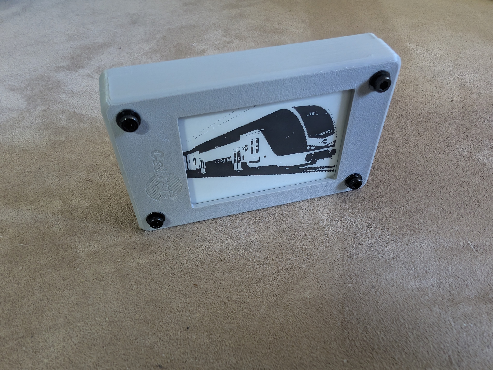
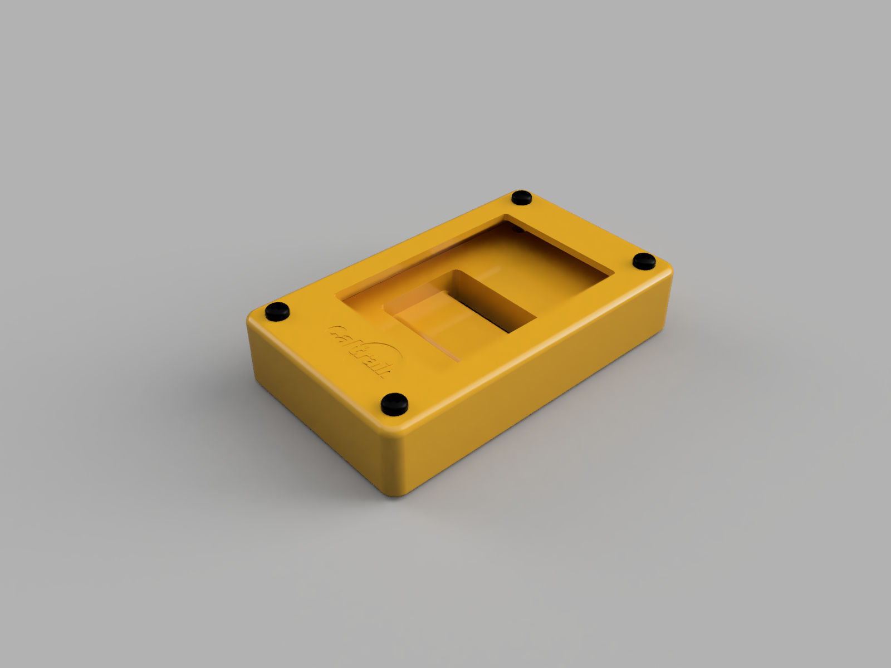
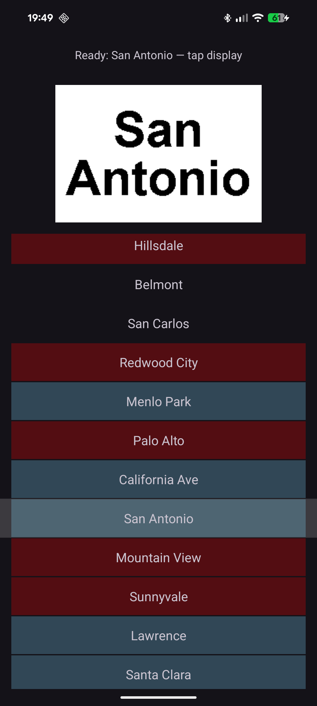

# E-Ink Bike Tag for Caltrain

## What is this project?

A 3D-printed case for an e-ink display and an accompanying Android app that makes it quick and easy to update your destination when you ride Caltrain with a bike.

## Why is this project?

This project was inspired by my ridership patterns on Caltrain - fairly frequent, but rarely consistent. Normal bike tags never really worked for me - I live between two stations on a zone boundry, so I will go to whichever one saves me a few dollars. My destinations also varied as I mostly used Caltrain for non-commuting purposes. When I saw [this reddit post](https://www.reddit.com/r/caltrain/comments/1mhx5lh/i_made_a_programmable_bike_tag/) by u/BruceHalperin I was inspired to get the e-ink display. However, I wanted to build a case that would allow the bike tag to stay securely attached to my bike while keeping it protected; this seemed like a great opportunity to get into 3D printing. I was also not a fan of the app Waveshare provides to write content to the display as it was clunky and not well-suited for quickly writing a station a name to the display, as you had to type in the text each time. When I saw that Waveshare provides an Android SDK, I saw an opportunity to learn a little bit about Android development.

## Project Components

### [The Display](<e-ink display/README.md>)

The display is a Waveshare 2.7" parasitic-NFC-powered e-ink display. It uses power from your phone via NFC and updates the content on the screen. The resolution of 264 x 176 pixels is enough for a few lines of text.

### [The Case](case/README.md)

I designed a 3D-printed case in Autodesk Fusion based on measurements of the e-ink display PCB and specifications from Waveshare's website. The case consists of a top lid and bottom base secured with an M3×20mm screw, nut, and washers that hold the PCB against the lid. Press-fit nuts embedded in the base hold everything together (I used gentle heat to make insertion easier, because I did not have any heat-set inserts on hand). The base also includes two slots for a velcro strap to secure the case to a bike.

### [The App](android_app/README.md)

The app provides a simple interface: scroll through a list of stations, select one, and tap the display to update it. I pre-generated the images to keep the app simple and performant, which reduces flexibility but keeps it quick and easy to use. The Waveshare app is still available if you need custom text or images, or you can create your own BMPs and recompile the app. Currently, the app is installed via the Android Studio debug interface; building a distribution APK is left as an exercise for the reader (or future me).

#### [BMP Generator](bmp_generator/README.md)

I also wrote a simple BMP Generator to make images for the app, which reads YAML file of station names (with a few attributes) to create BMPs in the right size and name them appropriately. You can create BMPs however you would like, but this way works well for the Caltrain station list.

## Notes

### AI Disclosure

I used AI to help me with most aspects of this project, especially the app development. However, I was involved in every step and reviewed (as best I could) all the code.
